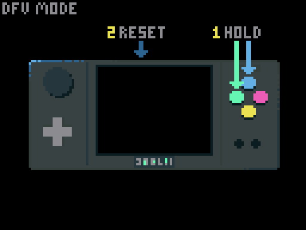

# 32Blit Firmware <!-- omit in toc -->

This repository includes firmware and a launcher for the 32Blit that lets you manage games on SD card, and copy or flash games via USB serial.

- [Installing from a Release](#installing-from-a-release)
- [Prerequisites](#prerequisites)
- [Building & Flashing The 32Blit Firmware](#building--flashing-the-32blit-firmware)
  - [Building The Firmware](#building-the-firmware)
  - [Flashing The Firmware To Your 32Blit](#flashing-the-firmware-to-your-32blit)
    - [Without DFU](#without-dfu)
    - [Prepare the device](#prepare-the-device)
    - [Linux and macOS](#linux-and-macos)
    - [Windows](#windows)
  - [Flashing a launcher](#flashing-a-launcher)
- [Troubleshooting](#troubleshooting)
  - [Finding The Right DFU Device](#finding-the-right-dfu-device)
  - [DFU device not showing up in Windows](#dfu-device-not-showing-up-in-windows)

# Installing from a Release

Unless you want to work on the firmware, you can install the latest pre-built firmware/launcher:

1. Go here: https://github.com/32blit/32blit-sdk/releases/latest
2. Download ` 32blit-sdk-[version]-STM32.zip` from the assets at the bottom
3. Install `firmware-update-[version].blit`
4. Install `launcher.blit`

Both files can be installed using `32blit install [file].blit` or by copying to the SD card. You should rename the firmware update to `firmware-update.blit` if copying to the SD card as this will cause it to automatically install.

The rest of these instructions cover building the firmware from source.

# Prerequisites

In order to use the 32blit firmware, you will need to:

1. Build and install the 32Blit firmware (if you don't have it already)
2. Install the 32blit tools `pip install 32blit`
3. Flash the firmware and a launcher to your 32Blit

You must make sure you have an ARM GCC cross-compile environment set up on your computer, refer to the relevant documentation below:

* [Windows](Windows-WSL.md)
* [Linux](Linux.md)
* [macOS](macOS.md)
* [ChromeOS](ChromeOS.md)

These instructions assume that you will create build directories in the *root* of this repository.

# Building & Flashing The 32Blit Firmware

## Building The Firmware

From the root of the repository prepare cmake to target 32Blit if you haven't already:

```
mkdir build.stm32
cd build.stm32
cmake .. -DCMAKE_TOOLCHAIN_FILE=../32blit.toolchain
```

Now build the firmware binary and dfu files (for Linux/macOS and Windows flashing respectively):

```
make firmware
```

## Flashing The Firmware To Your 32Blit

### Without DFU
If you currently have a working firmware, you can flash a new firmware without using DFU mode by running:
```
make firmware-update.flash
```

Alternatively, you can run `make firmware-update` and install the resulting `32blit-stm32/firmware-update/firmware-update.blit` with any of the methods described [here](32blit.md#uploading-an-example).

### Prepare the device

To enter DFU mode either hold the X & Y buttons and press the reset button or select `dfu mode` from the on device menu. The screen will go dark, this is normal.



### Linux and macOS

Install `dfu-util` from your package manager then enter:

```
sudo dfu-util -a 0 -s 0x08000000 -D 32blit-stm32/firmware/firmware.bin
```

### Windows

You will need [DfuSe Demonstration from st.com](https://www.st.com/en/development-tools/stsw-stm32080.html)) to flash `firmware.dfu` to your device.

Once installed you should be able, from the `build.stm32` directory you created earlier, to flash 32Blit's firmware by running:

```
../tools/wsl-flash 32blit-stm32/firmware/firmware.dfu
```

Note: `wsl-flash` uses a hard-coded path to DfuSe 3.0.6 in `c:\Program Files (x86)`

If this fails you can run the `DfusSeDemo` application and pick your 32Blit (it should be "STM Device in DFU Mode") from the "Available USB Devices" drop down.

In the "Upload Action" section hit "Choose" and select the `firmware.dfu` file you built earlier. (It should be in `build.stm32/32blit-stm32/firmware/firmware.dfu`) and finally hit "Upgrade" to flash the file.

## Flashing a launcher
Flashing a launcher is similar to [flashing a game/example](32blit.md#uploading-an-example), run `make launcher` and the output is `launcher/launcher.blit`. `launcher.blit` is automatically flashed from the SD card if it exists.

# Troubleshooting

## Finding The Right DFU Device

If you have more than one device in DFU mode connected to your computer then find the 32blit using `lsusb` and add `-d vid:pid` to the dfu-util command. Replace `vid:pid` with the 4 character ID strings to target the correct device.

## DFU device not showing up in Windows

If you have put the device into DFU mode, but the DfuSe tool refuses to recognize it, you might need to update the DFU driver by hand.

1. First, check your device manager while the 32blit is connected in DFU mode. If there is a new device called **DFU in FS Mode** under the
"Other devices" category, with a possible exclamation mark over it, you will need to update the driver.
2. Right click on this device, and select _Update driver_. You will want to look for a driver on your computer.
3. Select the following folder: `C:\Program Files (x86)\STMicroelectronics\Software\DfuSe v3.0.6\Bin\Driver\Win10\` This folder contains the driver.
4. After the driver has been updated, the DfuSe tools should now see the 32blit as a DFU device and you can go ahead with the firmware update.
