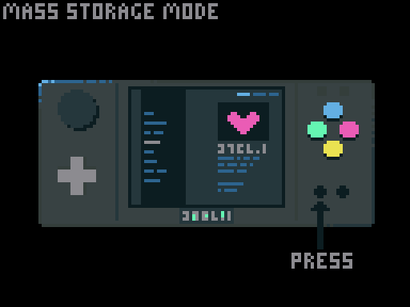
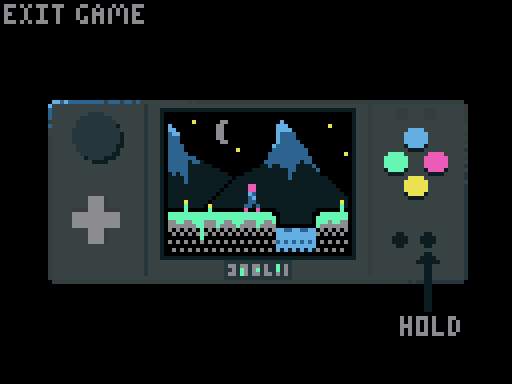

# Building & Running On 32Blit <!-- omit in toc -->

These instructions assume a basic familiarity with the Linux command-line and with compiling software from source.

- [Prerequisites](#prerequisites)
  - [Examples](#examples)
    - [Building An Example](#building-an-example)
    - [Uploading An Example](#uploading-an-example)
      - [Via mass-storage mode](#via-mass-storage-mode)
      - [With make](#with-make)
      - [With the 32blit tool](#with-the-32blit-tool)
  - [Your Own Projects](#your-own-projects)
  - [Running games](#running-games)
    - [Launching](#launching)
    - [Exiting](#exiting)
- [Troubleshooting](#troubleshooting)
    - [Flasher Can't Find 32Blit Port](#flasher-cant-find-32blit-port)
    - [CMake Errors](#cmake-errors)

# Prerequisites

Make sure you've prepared your 32Blit by following the instructions in:

* [Building & Flashing The 32Blit Firmware](32Blit-Firmware.md#building--flashing-the-32blit-firmware)

You should also make sure you have a cross-compile environment set up on your computer, refer to the relevant documentation below:

* [Windows](Windows-WSL.md)
* [Linux](Linux.md)
* [macOS](macOS.md)
* [ChromeOS](ChromeOS.md)

## Examples

### Building An Example

To build an example for 32blit using `arm-none-eabi-gcc` you must prepare the Makefile with CMake using the provided toolchain file.

From the root of the repository:

```
mkdir build.stm32
cd build.stm32
cmake .. -DCMAKE_TOOLCHAIN_FILE=../32blit.toolchain
```

And then run `make examplename` to build an example.

The result of the build will be a `.blit`, `.bin`, `.hex` and `.elf` file in the relevant example directory.

For example you might type `make raycaster` which will give you `examples/raycaster/raycaster.blitn`.

### Uploading An Example

#### Via mass-storage mode

If your 32blit is connected to your computer with a USB cable, you can switch into mass-storage mode and copy files over as if it were a USB storage device.



A "USB Drive" device should pop up, and the text "Mass Storage Mode (MSC Mounted)" will show on your 32blit's screen.

Once you're done copying files, eject the drive and your 32blit should resume.

#### With make

With your device out of DFU mode (displaying the game list), you can now run:

```
make [example-name].flash
```

For example you can:

```
make logo.flash
```

To build, flash and run the `logo` example.

#### With the 32blit tool

Alternatively, you can use the tool to flash a game directly:

```
32blit install filename.blit
```

Or save it to your SD card:

```
32blit install filename.blit /
```

(If `32blit` is not found you can use `python3 -m ttblit` instead)


## Your Own Projects

You can build a project based on the template by running:

```
mkdir build.stm32
cd build.stm32
cmake .. -D32BLIT_DIR="/path/to/32blit/repo" -DCMAKE_TOOLCHAIN_FILE=/path/to/32blit/repo/32blit.toolchain
make
```

## Running games

### Launching

Just select the game you want to launch from the menu screen and press A.

### Exiting

You can either press Menu and select "Exit Game" or long-press Menu to exit.



# Troubleshooting

### Flasher Can't Find 32Blit Port

If `make example.flash` fails with `Unable to find 32Blit`, re-run `cmake` with `-DFLASH_PORT=[PORT PATH]`.  

Port-detection does not work if your device is in DFU mode. Either reset it to get it out, or it it's stuck in DFU mode (or just boots into a black screen), you may need to reflash the firmware.

### CMake Errors

If you see `cannot create target because another target with the same name already exists` you've probably run `cmake ..` in the wrong directory (the project directory rather than the build directory), you should remove all but your project files and `cmake ..` again from the build directory.
